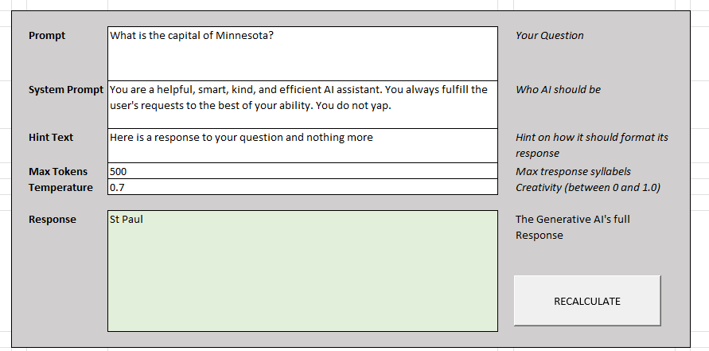
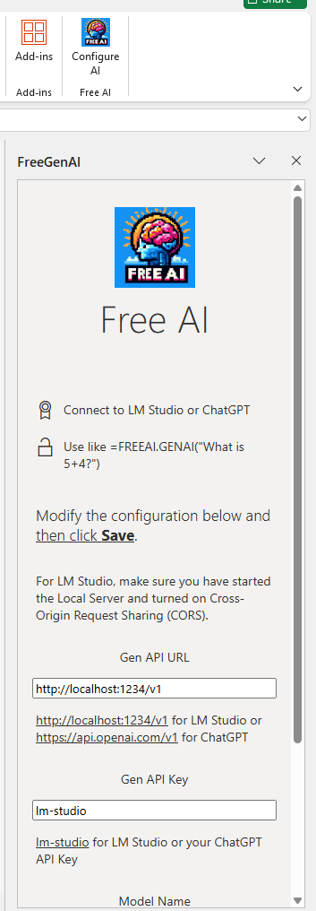
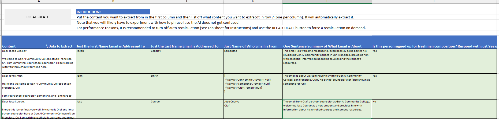
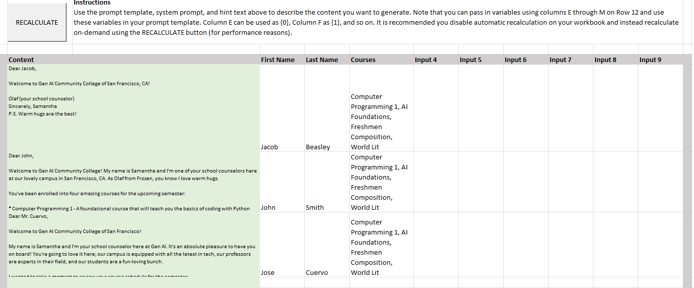
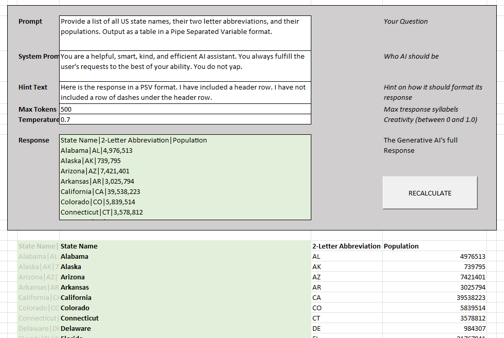
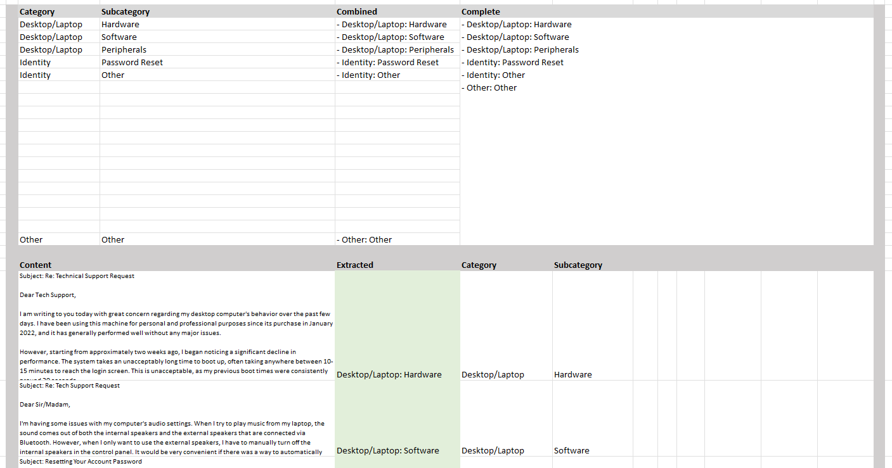

# Excel Free AI

Excel Free AI is an open-source Excel add-in that enables users to query and interact with AI models locally, without relying on cloud-based APIs. Designed to work with models like **Llama 3.1 7B** running on **LM Studio** and other local AI runtimes, this add-in provides seamless integration of AI capabilities directly within Excel. It is also remarkeably simple to use and could easily be expanded in the future to do more. 

## Features

- **Local AI Processing** – Run against AI models running on your own machine, ensuring data privacy.
- **Easy Integration** – Simple installation as an Excel add-in.
- **Query AI Models** – Send prompts and receive AI-generated responses directly within Excel.
- **Customizable Settings** – Configure model parameters, temperature, and response length.
- **Supports Multiple Models** – Works with AI models that run locally, such as those in LM Studio, but can also work with ChatGPT or other services.
- **Open Source** – Modify and improve the add-in as needed. It is intentionally simple and could be easily extended. 
- **Simple** – This is an amazingly simple plugin. 

## Examples

I have included 2 starter workbooks. One with macros and buttons to force recalculations on demand and one without. 

- [GenAIExamples.xlsx](https://github.com/jacobbeasley/excel-freeai/raw/refs/heads/master/GenAIExamples.xlsm)
- [GenAIExamples-With Macros.xlsm](https://github.com/jacobbeasley/excel-freeai/raw/refs/heads/master/GenAIExamples-With%20Macros.xlsm)

## Installation

### Prerequisites
- Windows or macOS with Excel installed
- [LM Studio](https://lmstudio.ai/) or another local AI runtime hosting an LLM Model (or a chatgpt account). 
- If using LM Studio, be sure to start the Local Server and check the Cross-Origin Request Sharing (CORS) ON. 
- A locally installed AI model (e.g., Llama 3.1 7B - you can find it by searching for lmstudio-community/Meta-Llama-3.1-8B-Instruct-GGUF)

## Installation

### Mac

Download and run [install-freeai.sh](https://github.com/jacobbeasley/excel-freeai/raw/refs/heads/master/install-freeai.sh) or run this command from a terminal and restart Excel: 

    wget -P ~/Library/Containers/com.microsoft.Excel/Data/Documents/wef https://raw.githubusercontent.com/jacobbeasley/excel-freeai/master/freegenai-manifest-dist.xml

### Windows

Download and run [install-freeai.bat](https://github.com/jacobbeasley/excel-freeai/raw/refs/heads/master/install-freeai.bat) or run these commands from a CMD terminal and restart Excel: 

    wget https://raw.githubusercontent.com/jacobbeasley/excel-freeai/master/freegenai-manifest-dist.xml
    reg add "HKEY_CURRENT_USER\Software\Microsoft\Office\16.0\WEF\Developer" /v af26d049-d35a-4e62-bdbf-b0f076b05cbf /d "%cd%\freegenai-manifest-dist.xml" /t REG_SZ

### Other Notes

If you want to share this with members of your company and/or see [the official microsoft docs about publishing Excel add-ins](https://learn.microsoft.com/en-us/office/dev/add-ins/publish/publish).

## Usage

1. Open Excel and navigate to the **Excel Free AI** tab.
2. Enter your prompt into the designated cell or input box.
3. Click **Run AI Query** to send your prompt to the locally running model.
4. View the AI-generated response in the designated output cell.
5. Adjust model parameters (temperature, max tokens, etc.) as needed.

For more information, see [Microsoft's Documentation](https://learn.microsoft.com/en-us/office/dev/add-ins/excel/excel-add-ins-overview)

## Local Development

This will work in cmd or powershell so long as you have installed the latest LTS (long term support) version of node from [https://nodejs.org/en/download/](https://nodejs.org/en/download/)

Install a long-term-support version of NodeJS then...

    npm install
    npm run start

This will compile the code, launch excel, as well as install the add-in in your Excel session. 

## Configuration

You can configure Excel Free AI by editing the settings file (`config.json`) or through the add-in settings panel:
- **Model Path**: Path to the AI model file
- **API Endpoint**: URL for local model API (e.g., `http://localhost:5000`)
- **Temperature**: Controls randomness of responses
- **Max Tokens**: Limits response length

## Contributing

We welcome contributions! To contribute:
1. Fork the repository on GitHub.
2. Create a new branch for your feature or bug fix.
3. Submit a pull request with a detailed explanation of your changes.

## License

This project is licensed under the [MIT License](LICENSE). 

## Acknowledgments

- [LM Studio](https://lmstudio.ai/) for making local AI model deployment accessible.
- Open-source AI models like Llama 3.1 7B (Thanks Zuck!).
- The project's creator, [Jacob Beasley](https://github.com/jacobbeasley/)

---

For more details, visit the [GitHub repository](https://github.com/jacobbeasley/excel-freeai).

## Some screenshots of it in action

Configuration of LLM

Lab Example to Experiment

Example of Extracting Content

Example of Generating Content using Prompt Template

Example of Generating Table of Data

Example of Classifying content into categories and subcategories

